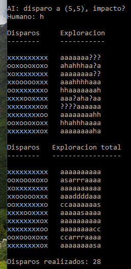

# battleship (project #1)

Battleship is a simulator of the board game "Battleship". It's not the actual full game, but just half of it, where the AI tries to guess where you place your ships on your physical board.

### Demo

### Note

The code, as opposed to the globally recommended style, is in Spanish due to educational purposes, as a request from the AyED subject of our university.
